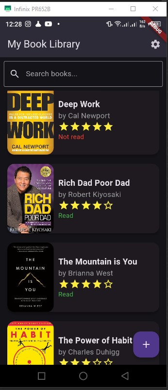
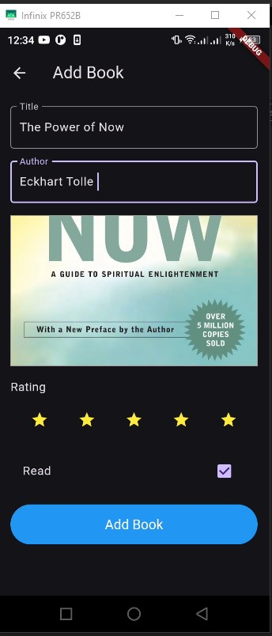
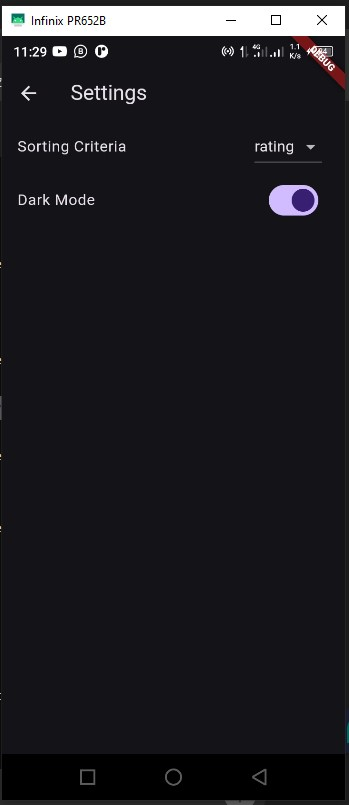

Here's how you can integrate the screenshots section into your README file, following the structure you’ve outlined:

```markdown
# Flutter Book Library App

A cross-platform mobile application developed using Flutter that allows users to manage their personal book library. The app includes features to add, edit, delete, and view books. Users can also rate books and mark them as read or unread. User preferences such as the sorting order of the book list are stored using Shared Preferences.

## Key Features

1. **UI Design:**
   - Use Flutter's Material Design widgets for a cohesive look.
   - Implement a home screen with a list of books.
   - Create screens for adding/editing book details.
   - Design a book detail view.
   - Implement a settings screen.

2. **Data Persistence (SharedPreferences):**
   - Use `shared_preferences` package to store user preferences.
   - Save sorting preferences (by title, author, rating).
   - Store theme preferences (light/dark mode).

3. **Data Management (SQLite):**
   - Use `sqflite` package for local database.
   - Implement CRUD operations for books.
   - Create a data access layer to manage database operations.

4. **State Management:**
   - Use `Provider` or `Riverpod` for state management.

5. **Additional Features:**
   - Add, edit, and delete books.
   - Rate books and mark as read/unread.
   - Sort books based on different criteria.
   - Search functionality.
   - Theme switching (light/dark mode).

## Screenshots

### Welcome Screen


### Home Screen


### Add Screen


### Edit Screen


### Book Detail View


### Search Screen


### Settings View


## Getting Started

### Prerequisites

- Flutter SDK: [Install Flutter](https://flutter.dev/docs/get-started/install)
- Dart: Included with Flutter
- A code editor (e.g., Visual Studio Code, Android Studio)

### Installation

1. **Clone the repository:**

   ```bash
   git clone https://github.com/SethLoveByiringiro/flutter-book-library-app.git
   cd flutter-book-library-app
   ```

2. **Install dependencies:**

   ```bash
   flutter pub get
   ```

3. **Run the app:**

   ```bash
   flutter run
   ```

## Contributing

Feel free to contribute by opening issues or submitting pull requests. 

## License

This project is licensed under the MIT License. See the [LICENSE](LICENSE) file for details.
